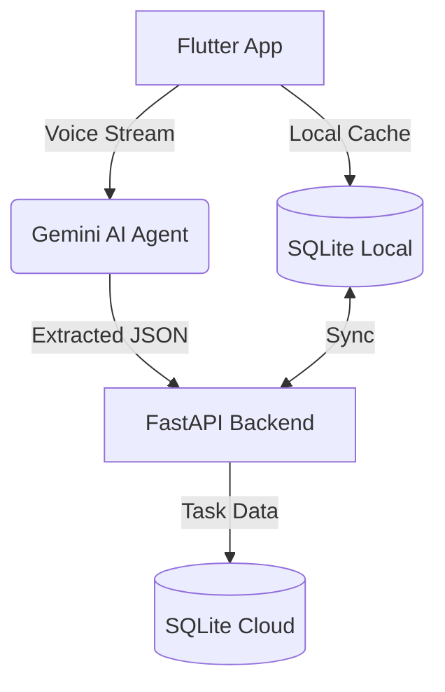

# AI Personal Mentor: Voice-to-Task 🎓🚀

AI Personal Mentor is a premium mobile application designed for IT undergraduates to manage their study tasks through real-time voice commands. Powered by **Google Gemini AI**, the app extracts complex tasks, deadlines, and subjects from speech, organizing them into a professional, persistent dashboard.

## ✨ Key Features

- **🎙️ Real-time Voice Extraction**: Record your study goals and let Gemini AI automatically categorize them into specific IT subjects and extract deadlines.
- **📱 Premium Dual-Mode UI**: A state-of-the-art interface featuring a professional **Indigo & Emerald** palette, available in both Light and Dark modes.
- **⚡ Offline Persistence**: Built with an "Offline-First" architecture using **SQLite**, allowing you to view and manage tasks without an internet connection.
- **↔️ Swipe-to-Action**: Fluid mobile-first interactions—swipe right to complete tasks and left to delete.
- **🧩 Dynamic Categorization**: Centralized subject management ensures the AI and UI are always synced across 9+ technical categories (SE, DSA, AI, etc.).
- **🔄 Background Sync**: Seamlessly synchronizes data between the local device and a high-performance FastAPI backend.

## 🛠️ Tech Stack

### Frontend (Mobile App)
- **Framework**: Flutter
- **State Management**: Provider
- **Local Database**: sqflite
- **Animations**: animate_do
- **Typography**: Google Fonts (Outfit)

### Backend (AI & API)
- **Language**: Python
- **Framework**: FastAPI
- **AI Model**: Google Gemini 1.5 Flash
- **Database**: SQLAlchemy + SQLite
- **Audio Processing**: Google Generative AI SDK

## 🏗️ Architecture



## 🚀 Getting Started

### Prerequisites
- Flutter SDK
- Python 3.10+
- Google Gemini API Key

### 1. Backend Setup
```bash
cd backend
pip install -r requirements.txt
# Add your GENAI_API_KEY to .env
uvicorn app:app --reload
```

### 2. Mobile App Setup
```bash
cd mobile_app
flutter pub get
flutter run
```

## 🎨 UI Showcase

| Home Screen | Task Details | Voice Interaction |
| :---: | :---: | :---: |
|  |  |  |

---

## 📄 License
This project is licensed under the MIT License - see the LICENSE file for details.

## 🤝 Contributing
Contributions are welcome! Please open an issue or submit a pull request for any improvements.

---
*Built with ❤️ for IT Undergraduates.*
